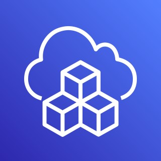

# Welcome to my first  CDK project

 

This is my first project for CDK development with TypeScript.

The `cdk.json` file tells the CDK Toolkit how to execute your app.

## Useful commands

- `npm run build` compile typescript to js
- `npm run watch` watch for changes and compile
- `npm run test` perform the jest unit tests
- `cdk deploy` deploy this stack to your default AWS account/region
- `cdk diff` compare deployed stack with current state
- `cdk synth` emits the synthesized CloudFormation template
- `cdk destroy` destroys the stack

## Useful references

- https://docs.aws.amazon.com/cdk/api/v1/docs/aws-construct-library.html
- https://docs.aws.amazon.com/cdk/v2/guide/home.html
- https://cdkworkshop.com/20-typescript.html

## Implementation

The following has been implemented

- VPC - https://docs.aws.amazon.com/cdk/api/v1/docs/@aws-cdk_aws-ec2.Vpc.html
- S3 Bucket - https://docs.aws.amazon.com/cdk/api/v1/docs/aws-s3-readme.html
- Lambda Function - https://docs.aws.amazon.com/cdk/api/v1/docs/aws-lambda-readme.html
- Api Gateway - https://docs.aws.amazon.com/cdk/api/v1/docs/aws-apigateway-readme.html
- SQS Queue - https://docs.aws.amazon.com/cdk/api/v1/docs/aws-sqs-readme.html
- SNS Topic - https://docs.aws.amazon.com/cdk/api/v1/docs/aws-sns-readme.html
- SNS Subscription - https://docs.aws.amazon.com/cdk/api/v1/docs/aws-sns-subscriptions-readme.html
- DynamoDB - https://docs.aws.amazon.com/cdk/api/v1/docs/aws-dynamodb-readme.html
